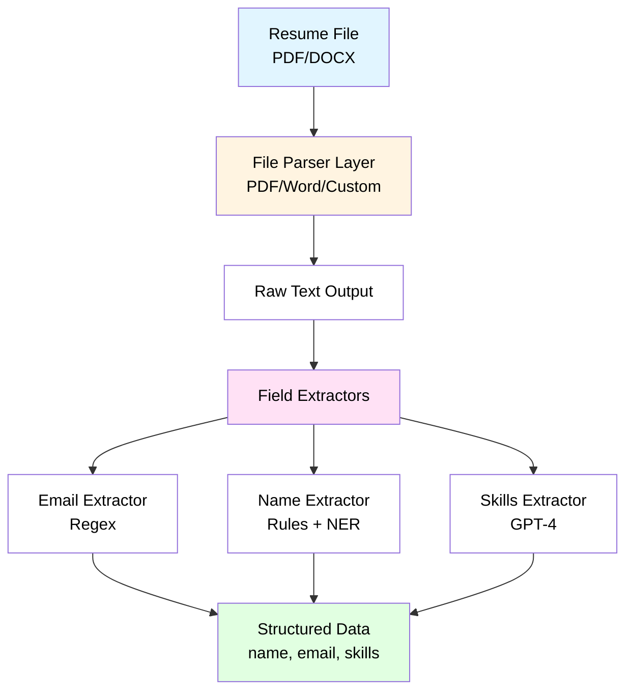
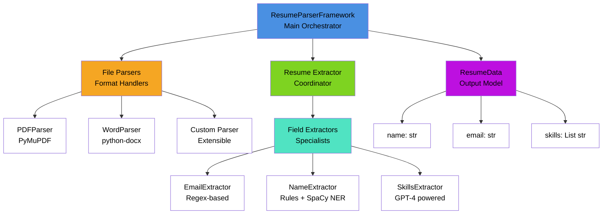

# Resume Parser Framework - User Manual

> A production-ready resume parsing system that extracts structured data (name, email, skills) from PDF and Word resume documents.

## Table of Contents

1. [Architecture Overview](#architecture-overview)
2. [Quick Start Guide](#quick-start-guide)
3. [Installation](#installation)
4. [Running the Parser](#running-the-parser)
5. [Testing the Framework](#testing-the-framework)
6. [Understanding the Output](#understanding-the-output)
7. [Troubleshooting](#troubleshooting)
8. [Technical Details](#technical-details)

---

## Architecture Overview

The framework uses a layered architecture with clear separation of concerns:

**Text-Based Architecture:**
```
ResumeParserFramework (Main API)
├── File Parsers (Strategy Pattern)
│   ├── PDFParser (PyMuPDF)
│   └── WordParser (python-docx)
└── Resume Extractor (Coordinator)
    └── Field Extractors (Strategy Pattern)
        ├── EmailExtractor (Regex)
        ├── NameExtractor (Rules + SpaCy NER)
        └── SkillsExtractor (GPT-4)
```

**Visual Architecture Diagram:**



**Component Breakdown:**



**Design Patterns:**

- **Strategy Pattern**: Different parsers/extractors for different strategies
- **Dependency Injection**: Easy testing and customization
- **Factory Pattern**: Parser registry for dynamic file format handling
- **Single Responsibility**: Each class has one clear purpose

**Project Structure:**

```
ResumeParser/
├── src/resume_parser/     # Main package
│   ├── core/              # Core orchestration
│   ├── parsers/           # File format parsers
│   ├── extractors/        # Field extractors
│   ├── models.py          # Data models
│   ├── exceptions.py      # Custom exceptions
│   └── utils/             # Utilities
├── tests/                 # Test suite
│   ├── unit/              # Unit tests
│   └── integration/       # Integration tests
├── outputs/               # Log files (gitignored)
│   ├── csv/               # CSV logs
│   └── json/              # JSON logs
├── resumes/               # Input folder (gitignored)
├── README.md              # This file
├── requirements.txt       # Production dependencies
└── pyproject.toml         # Project configuration
```

---

## Quick Start Guide

This framework extracts structured information from resume files. You can:
- Parse individual resumes or batches
- Extract candidate name, email, and skills automatically
- View results in JSON format or CSV logs
- Handle various resume formats (PDF, Word documents)

**Minimum Requirements:**
- Python 3.8 or higher installed
- OpenAI API key (for skills extraction)
- Internet connection (for API calls)

**Framework Capabilities:**
- Object-oriented design patterns (Strategy, Dependency Injection)
- Production-ready error handling and logging
- Comprehensive test coverage (53 tests)
- Extensible architecture for adding new features

---

## Installation

### Step 1: Prerequisites

**Check Python Version:**
```bash
python --version
# Should show Python 3.8 or higher
```

If Python is not installed, download from [python.org](https://www.python.org/downloads/)

### Step 2: Clone the Repository

```bash
git clone https://github.com/ovokpus/ResumeParser.git
cd ResumeParser
```

### Step 3: Install Dependencies

**Option A: Using `uv` (Recommended - Faster)**
```bash
# Install uv if not already installed
curl -LsSf https://astral.sh/uv/install.sh | sh

# Install dependencies
uv sync
```

**Option B: Using `pip` (Standard)**
```bash
# Create virtual environment
python -m venv venv

# Activate virtual environment
# On macOS/Linux:
source venv/bin/activate
# On Windows:
venv\Scripts\activate

# Install dependencies
pip install -r requirements.txt
```

### Step 4: Install SpaCy Language Model

```bash
# Using uv:
uv run python -m spacy download en_core_web_sm

# Using pip:
python -m spacy download en_core_web_sm
```

### Step 5: Configure OpenAI API Key

**Create `.env` file:**
```bash
# Copy example file
cp .env.example .env

# Edit .env and add your OpenAI API key
# OPENAI_API_KEY=sk-your-actual-api-key-here
```

**Get OpenAI API Key:**
1. Go to [platform.openai.com](https://platform.openai.com)
2. Sign up or log in
3. Navigate to API Keys section
4. Create a new secret key
5. Copy the key (starts with `sk-`)
6. Paste into `.env` file

**Note:** Skills extraction requires a valid OpenAI API key. Without it, name and email extraction will still work, but skills extraction will fail.

### Step 6: Verify Installation

```bash
# Check OpenAI connectivity
uv run python check_openai.py
# OR
python check_openai.py
```

Expected output:
```
============================================================
OpenAI API Connectivity Check
============================================================

API Key Set: [OK]
API Key Valid: [OK]
Connected: [OK]
Model Available: [OK]
Model: gpt-4-turbo-preview
Response Time: 1234.56ms

============================================================
[OK] OpenAI API is accessible and working correctly!
```

---

## Running the Parser

### Method 1: Parse Single Resume (Interactive Demo)

**Using the demo script:**
```bash
uv run python demo.py
# OR
python demo.py
```

This demonstrates the framework capabilities with example data (no actual resume file needed).

### Method 2: Parse Resumes from Folder (Recommended)

**Basic Usage:**
```bash
# Place resume files in the 'resumes/' folder
# Then run:
uv run python parse_and_log.py
# OR
python parse_and_log.py

# Or specify a different folder:
uv run python parse_and_log.py tests/test_data
```

**What This Does:**
- Processes all PDF and DOCX files in the specified folder
- Shows detailed output for each resume
- Logs results to `outputs/csv/parsing_log.csv` (append-only)
- Creates timestamped JSON files in `outputs/json/`

**Example Output:**
```
Found 3 resume file(s) in resumes
Results will be logged to:
  - CSV: outputs/csv/parsing_log.csv (append-only, single file)
  - JSON: outputs/json/parsing_log_<timestamp>.json (timestamped)

Starting processing...

======================================================================
RESUME 1 of 3
======================================================================

======================================================================
PARSING RESUME: john_doe_resume.pdf
======================================================================
File: resumes/john_doe_resume.pdf
Size: 42,042 bytes
Type: .PDF

[Step 1] Parsing file to text...
  [OK] Parsed in 0.25 seconds

[Step 2] Extracted Data:
----------------------------------------------------------------------
Status: SUCCESSFUL

Name:  John Doe
Email: john.doe@email.com
Skills: 15 extracted

Skills List:
  1. Python
  2. Machine Learning
  3. Docker
  ...

[Step 3] JSON Output:
----------------------------------------------------------------------
{
  "name": "John Doe",
  "email": "john.doe@email.com",
  "skills": ["Python", "Machine Learning", "Docker", ...]
}

[Step 5] Logged to Files:
----------------------------------------------------------------------
[OK] CSV: outputs/csv/parsing_log.csv
[OK] JSON: outputs/json/parsing_log_20251129_120000.json

Total processing time: 2.45 seconds
```

### Method 3: Programmatic Usage (Python Code)

**Basic Example:**
```python
from resume_parser import ResumeParserFramework

# Initialize framework
framework = ResumeParserFramework()

# Parse a resume
try:
    resume_data = framework.parse_resume("path/to/resume.pdf")
    
    # Access extracted data
    print(f"Name: {resume_data.name}")
    print(f"Email: {resume_data.email}")
    print(f"Skills: {', '.join(resume_data.skills)}")
    
    # Get as dictionary
    data_dict = resume_data.to_dict()
    
except FileNotFoundError:
    print("Error: Resume file not found")
except Exception as e:
    print(f"Error: {e}")
```

**Batch Processing:**
```python
from pathlib import Path
from resume_parser import ResumeParserFramework

framework = ResumeParserFramework()
resume_folder = Path("resumes/")

results = []
for resume_file in resume_folder.glob("*.pdf"):
    try:
        data = framework.parse_resume(resume_file)
        results.append({
            "filename": resume_file.name,
            "name": data.name,
            "email": data.email,
            "skills": data.skills,
            "skill_count": len(data.skills)
        })
        print(f"[OK] {resume_file.name}")
    except Exception as e:
        print(f"[FAIL] {resume_file.name}: {e}")

# Save results
import json
with open("parsed_resumes.json", "w") as f:
    json.dump(results, f, indent=2)
```

---

## Testing the Framework

For comprehensive test documentation, see **[tests/README.md](tests/README.md)**.

### Quick Start

```bash
# Run all tests
uv run pytest
# OR
pytest

# Run with verbose output
uv run pytest -v

# Run with coverage report
uv run pytest --cov=src/resume_parser --cov-report=html
```

### Test Summary

- **Total Tests**: 53 tests
- **Unit Tests**: 28 tests (models, parsers, extractors, framework)
- **Integration Tests**: 25 tests (setup, connectivity, real parsing, edge cases)
- **Test Coverage**: 90%+

### Quick Test Commands

**Run all tests:**
```bash
uv run pytest
```

**Run only unit tests:**
```bash
uv run pytest tests/unit/ -v
```

**Run only integration tests:**
```bash
uv run pytest tests/integration/ -v
```

**Run specific test file:**
```bash
uv run pytest tests/integration/test_setup_verification.py -v
```

**Run edge case tests:**
```bash
uv run pytest tests/integration/test_comprehensive_resume_parsing.py -k "edge_case" -v
```

### Expected Results

All tests should pass:
```
========================= 53 passed in 5.23s =========================
```

For detailed test documentation, test organization, and examples, see **[tests/README.md](tests/README.md)**.

---

## Understanding the Output

### Parsing Status

Each resume parsing results in one of three statuses:

1. **SUCCESSFUL**: All fields extracted (name, email, and skills)
2. **PARTIAL SUCCESS**: At least one field extracted, but not all
3. **FAILED**: Parsing failed completely or no data extracted

### Output Formats

**1. Console Output:**
- Step-by-step parsing progress
- Extracted data display
- JSON representation
- Warnings or errors
- Processing time

**2. CSV Log (`outputs/csv/parsing_log.csv`):**
- Single append-only file
- Columns: date, timestamp, filename, status, json_output, reasons_explanations, name_extracted, email_extracted, skills_count, error_type, error_message
- Useful for historical analysis and reporting

**3. JSON Log (`outputs/json/parsing_log_<timestamp>.json`):**
- Timestamped files (one per processing session)
- Structured data format
- Easy to parse programmatically
- Contains full parsed data and metadata

### Example Output Files

**CSV Entry:**
```csv
date,timestamp,filename,status,json_output,reasons_explanations,name_extracted,email_extracted,skills_count,error_type,error_message
2025-11-29,2025-11-29T12:00:00.123456,resume.pdf,successful,"{""name"": ""John Doe"", ""email"": ""john@example.com"", ""skills"": [""Python"", ""Docker""]}",All fields extracted successfully,John Doe,john@example.com,2,,
```

**JSON Entry:**
```json
[
  {
    "date": "2025-11-29",
    "timestamp": "2025-11-29T12:00:00.123456",
    "filename": "resume.pdf",
    "status": "successful",
    "parsed_data": {
      "name": "John Doe",
      "email": "john@example.com",
      "skills": ["Python", "Docker"]
    },
    "reasons_explanations": "All fields extracted successfully",
    "name_extracted": "John Doe",
    "email_extracted": "john@example.com",
    "skills_count": 2,
    "error_type": "",
    "error_message": ""
  }
]
```

---

## Troubleshooting

### Common Issues and Solutions

#### Issue 1: Python Not Found

**Error:** `python: command not found`

**Solution:**
```bash
# Try python3 instead
python3 --version

# Or check if Python is in PATH
which python
which python3
```

#### Issue 2: SpaCy Model Not Found

**Error:** `OSError: [E050] Can't find model 'en_core_web_sm'`

**Solution:**
```bash
# Download the model
uv run python -m spacy download en_core_web_sm
# OR
python -m spacy download en_core_web_sm

# Verify installation
uv run python -c "import spacy; nlp = spacy.load('en_core_web_sm'); print('Model loaded successfully')"
```

#### Issue 3: OpenAI API Key Error

**Error:** `AuthenticationError` or `Invalid API key`

**Solution:**
```bash
# Check if .env file exists
ls -la .env

# Verify API key is set
cat .env | grep OPENAI_API_KEY

# Test connectivity
uv run python check_openai.py
```

**Common Mistakes:**
- API key not starting with `sk-`
- Extra spaces or quotes around the key
- Wrong key copied (make sure it's the secret key, not the key ID)

#### Issue 4: PDF Returns Empty Text

**Error:** `No text content extracted from PDF`

**Possible Causes:**
- PDF is image-based (scanned document)
- PDF is corrupted
- PDF has unusual encoding

**Solution:**
- Check if PDF is readable in a PDF viewer
- Try a different PDF file
- For image-based PDFs, OCR preprocessing is needed (not included in this framework)

#### Issue 5: Module Not Found Errors

**Error:** `ModuleNotFoundError: No module named 'resume_parser'`

**Solution:**
```bash
# Make sure you're in the project root directory
pwd  # Should show .../ResumeParser

# Make sure virtual environment is activated
which python  # Should show path to venv/bin/python

# Reinstall dependencies
uv sync
# OR
pip install -r requirements.txt
```

#### Issue 6: Permission Errors

**Error:** `PermissionError: [Errno 13] Permission denied`

**Solution:**
```bash
# Check file permissions
ls -l resume.pdf

# Make file readable
chmod 644 resume.pdf

# Or run with appropriate permissions
```

#### Issue 7: Rate Limit Errors from OpenAI

**Error:** `RateLimitError` or `429 Too Many Requests`

**Solution:**
- The framework automatically retries with exponential backoff
- Wait a few minutes and try again
- Check your OpenAI API usage limits at platform.openai.com
- Consider upgrading your OpenAI plan if needed

### Getting Help

**Check Logs:**
```bash
# View application logs
tail -f resume_parser.log

# Or check log level
grep LOG_LEVEL .env
```

**Run Diagnostics:**
```bash
# Check OpenAI connectivity
uv run python check_openai.py

# Run setup verification tests
uv run pytest tests/integration/test_setup_verification.py -v
```

---

## Technical Details

### Supported File Formats

- **PDF** (.pdf): Multi-page, encrypted PDFs handled gracefully
- **Word Documents** (.docx): Paragraphs and tables supported

### Configuration Options

Edit `.env` file for configuration:

```bash
# OpenAI Configuration
OPENAI_API_KEY=sk-your-key-here
OPENAI_MODEL=gpt-4-turbo-preview
OPENAI_MAX_TOKENS=1000
OPENAI_TEMPERATURE=0.1

# Logging
LOG_LEVEL=INFO
LOG_FILE=resume_parser.log

# Extraction
MAX_SKILLS_RETURNED=20
```

### Performance Metrics

- **Average Processing Time**: 2-5 seconds per resume (including GPT-4 API call)
- **API Cost**: ~$0.005-$0.01 per resume (GPT-4 Turbo)
- **Token Usage**: ~500-1000 tokens per resume
- **Success Rate**: Varies by resume quality (typically 80-95% for well-formatted resumes)

### Extensibility

The framework is designed to be easily extended:

**Add New File Format:**
```python
from resume_parser.parsers.base import FileParser
from resume_parser import ResumeParserFramework

class HTMLParser(FileParser):
    def parse(self, file_path):
        # Your parsing logic here
        return extracted_text

ResumeParserFramework.register_parser(".html", HTMLParser)
```

**Add New Extractor:**
```python
from resume_parser.extractors.base import FieldExtractor

class PhoneExtractor(FieldExtractor):
    def extract(self, text: str) -> str:
        # Your extraction logic here
        return phone_number
```

### Code Quality Metrics

- **Test Coverage**: 90%+
- **Total Tests**: 53 (28 unit + 25 integration)
- **Code Style**: Black formatter, PEP 8 compliant
- **Type Hints**: Complete type annotations throughout
- **Documentation**: Comprehensive docstrings (Google style)

### Dependencies

**Core Dependencies:**
- `pymupdf>=1.23.0` - PDF parsing
- `python-docx>=1.1.0` - Word document parsing
- `spacy>=3.8.0` - Natural language processing
- `openai>=1.0.0` - GPT-4 API integration
- `pydantic>=2.0.0` - Data validation and settings

**Development Dependencies:**
- `pytest>=7.0.0` - Testing framework
- `pytest-cov>=4.0.0` - Coverage reporting
- `black>=23.0.0` - Code formatting

See `pyproject.toml` for complete dependency lists. Dev dependencies can be installed with `uv sync --extra dev` or `pip install -e ".[dev]"`.

---

## Support and Resources

### Documentation Files

- `README.md` - This file (user manual)

### Example Scripts

- `demo.py` - Interactive demonstration
- `parse_and_log.py` - Batch processing script
- `check_openai.py` - OpenAI connectivity check

---

## License

MIT License - See LICENSE file for details.

---

**Last Updated:** November 29, 2025

**Version:** 1.0.0
