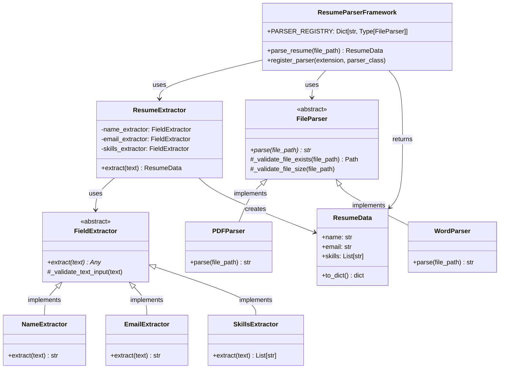

# Object-Oriented Design Documentation

This document provides a comprehensive overview of the Object-Oriented Design (OOD) principles, class hierarchy, and design patterns used in the Resume Parser Framework.

## Class Hierarchy

The framework follows a clear inheritance hierarchy with abstract base classes defining contracts:

**Inheritance Structure:**
```
ResumeParserFramework (Concrete Class)
├── Uses: ResumeExtractor (Concrete Class)
│   └── Uses: FieldExtractor (Abstract Base Class - ABC)
│       ├── NameExtractor (Concrete Implementation)
│       ├── EmailExtractor (Concrete Implementation)
│       └── SkillsExtractor (Concrete Implementation)
└── Uses: FileParser (Abstract Base Class - ABC)
    ├── PDFParser (Concrete Implementation)
    └── WordParser (Concrete Implementation)

ResumeData (Data Class)
└── Output model for structured resume data
```

**Text-Based Architecture:**
```
ResumeParserFramework (Main API)
├── File Parsers (Strategy Pattern via ABC)
│   ├── FileParser (Abstract Base Class)
│   ├── PDFParser (Concrete: PyMuPDF)
│   └── WordParser (Concrete: python-docx)
└── Resume Extractor (Coordinator)
    └── Field Extractors (Strategy Pattern via ABC)
        ├── FieldExtractor (Abstract Base Class)
        ├── EmailExtractor (Concrete: Regex)
        ├── NameExtractor (Concrete: Rules + SpaCy NER)
        └── SkillsExtractor (Concrete: GPT-4)
```

## Class Hierarchy Diagram



## Design Patterns

### 1. Strategy Pattern

**Implementation:**
- `FileParser` ABC defines parsing strategy interface
- `PDFParser` and `WordParser` implement different parsing strategies
- `FieldExtractor` ABC defines extraction strategy interface
- `EmailExtractor`, `NameExtractor`, `SkillsExtractor` implement different extraction strategies

**Benefits:**
- Easy to add new file formats (implement `FileParser`)
- Easy to add new extraction strategies (implement `FieldExtractor`)
- Runtime selection of strategies based on file type
- Follows Open/Closed Principle

**Code Example:**
```python
# Strategy Pattern: Different parsers for different file types
class FileParser(ABC):
    @abstractmethod
    def parse(self, file_path: Union[str, Path]) -> str:
        pass

class PDFParser(FileParser):
    def parse(self, file_path: Union[str, Path]) -> str:
        # PyMuPDF implementation
        pass

class WordParser(FileParser):
    def parse(self, file_path: Union[str, Path]) -> str:
        # python-docx implementation
        pass
```

### 2. Dependency Injection

**Implementation:**
- `ResumeExtractor` accepts dictionary of extractors in constructor
- `ResumeParserFramework` accepts custom `ResumeExtractor` instance
- Enables easy testing and customization

**Benefits:**
- Loose coupling between components
- Easy to mock dependencies in tests
- Flexible configuration
- Follows Dependency Inversion Principle

**Code Example:**
```python
# Dependency Injection: Custom extractors can be injected
extractors = {
    "name": CustomNameExtractor(),
    "email": EmailExtractor(),
    "skills": SkillsExtractor()
}
resume_extractor = ResumeExtractor(extractors=extractors)
framework = ResumeParserFramework(resume_extractor=resume_extractor)
```

### 3. Factory Pattern

**Implementation:**
- `PARSER_REGISTRY` maps file extensions to parser classes
- `register_parser()` method allows dynamic parser registration
- Enables extensibility without modifying core framework

**Benefits:**
- Dynamic object creation based on file extension
- Extensible without modifying existing code
- Centralized parser management

**Code Example:**
```python
# Factory Pattern: Parser registry for dynamic creation
class ResumeParserFramework:
    PARSER_REGISTRY: Dict[str, Type[FileParser]] = {
        ".pdf": PDFParser,
        ".docx": WordParser,
    }
    
    @classmethod
    def register_parser(cls, extension: str, parser_class: Type[FileParser]):
        cls.PARSER_REGISTRY[extension.lower()] = parser_class
```

### 4. Single Responsibility Principle

**Implementation:**
Each class has one clear purpose:
- `FileParser` → Extract text from files
- `FieldExtractor` → Extract one specific field
- `ResumeExtractor` → Coordinate multiple extractors
- `ResumeParserFramework` → Orchestrate parsing workflow

**Benefits:**
- Easier to understand and maintain
- Changes to one component don't affect others
- Better testability

## OOD Principles

### 1. Abstraction

**Implementation:**
- Abstract Base Classes (`FileParser`, `FieldExtractor`) define contracts
- Concrete classes implement these contracts
- Framework depends on abstractions, not concrete implementations

**Example:**
```python
from abc import ABC, abstractmethod

class FileParser(ABC):
    @abstractmethod
    def parse(self, file_path: Union[str, Path]) -> str:
        """Contract: All parsers must implement this method."""
        pass
```

### 2. Encapsulation

**Implementation:**
- Data validation and normalization encapsulated in `ResumeData`
- Internal validation methods are protected (`_validate_file_exists`)
- Public API exposes only necessary methods

**Example:**
```python
@dataclass
class ResumeData:
    name: str
    email: str
    skills: List[str]
    
    def __post_init__(self):
        """Encapsulated validation and normalization."""
        self.name = " ".join(self.name.split())  # Normalize whitespace
        self.email = self.email.lower().strip()   # Normalize email
        # Deduplicate skills...
```

### 3. Inheritance

**Implementation:**
- Concrete parsers (`PDFParser`, `WordParser`) inherit from `FileParser` ABC
- Concrete extractors inherit from `FieldExtractor` ABC
- Inheritance ensures consistent interfaces

**Example:**
```python
class PDFParser(FileParser):
    """Inherits from FileParser ABC."""
    def parse(self, file_path: Union[str, Path]) -> str:
        # Must implement abstract method
        return extracted_text
```

### 4. Polymorphism

**Implementation:**
- Framework works with any `FileParser` or `FieldExtractor` implementation
- Runtime selection of parsers based on file extension
- Different extractors can be swapped without changing framework code

**Example:**
```python
# Polymorphism: Framework works with any FileParser implementation
parser = framework.PARSER_REGISTRY[".pdf"]()  # Returns PDFParser
text = parser.parse(file_path)  # Calls PDFParser.parse()

parser = framework.PARSER_REGISTRY[".docx"]()  # Returns WordParser
text = parser.parse(file_path)  # Calls WordParser.parse()
```

### 5. Dependency Inversion

**Implementation:**
- Framework depends on abstractions (`FileParser`, `FieldExtractor`)
- Not on concrete implementations (`PDFParser`, `EmailExtractor`)
- High-level modules don't depend on low-level modules

**Example:**
```python
# Framework depends on FileParser abstraction, not PDFParser
class ResumeParserFramework:
    def parse_resume(self, file_path: Union[str, Path]) -> ResumeData:
        parser_class = self.PARSER_REGISTRY.get(extension)  # Returns FileParser type
        parser = parser_class()  # Creates concrete instance
        text = parser.parse(path)  # Uses abstraction
```

### 6. Open/Closed Principle

**Implementation:**
- Framework is open for extension (new parsers/extractors)
- Closed for modification (core framework unchanged)
- New functionality added via registration, not code changes

**Example:**
```python
# Open/Closed: Extend without modifying framework
class HTMLParser(FileParser):
    def parse(self, file_path: Union[str, Path]) -> str:
        # New parser implementation
        pass

# Register without modifying ResumeParserFramework
ResumeParserFramework.register_parser(".html", HTMLParser)
```

## Component Relationships

### Composition

- `ResumeParserFramework` **has-a** `ResumeExtractor`
- `ResumeExtractor` **has-a** `NameExtractor`, `EmailExtractor`, `SkillsExtractor`
- `ResumeParserFramework` **uses** `FileParser` implementations

### Inheritance

- `PDFParser` **is-a** `FileParser`
- `WordParser` **is-a** `FileParser`
- `NameExtractor` **is-a** `FieldExtractor`
- `EmailExtractor` **is-a** `FieldExtractor`
- `SkillsExtractor` **is-a** `FieldExtractor`

## Code Organization

The codebase is organized to reflect the OOD design:

```
src/resume_parser/
├── core/
│   ├── framework.py          # ResumeParserFramework (Orchestrator)
│   └── resume_extractor.py   # ResumeExtractor (Coordinator)
├── parsers/
│   ├── base.py               # FileParser (Abstract Base Class)
│   ├── pdf_parser.py         # PDFParser (Concrete)
│   └── word_parser.py        # WordParser (Concrete)
├── extractors/
│   ├── base.py               # FieldExtractor (Abstract Base Class)
│   ├── name_extractor.py    # NameExtractor (Concrete)
│   ├── email_extractor.py   # EmailExtractor (Concrete)
│   └── skills_extractor.py  # SkillsExtractor (Concrete)
└── models.py                 # ResumeData (Data Model)
```

## Testing OOD Design

The test suite comprehensively validates OOD principles and design patterns. This section demonstrates how tests verify the architecture.

### Test-to-Architecture Mapping

| Architecture Component | Test Files | Test Count | What's Tested |
|------------------------|------------|------------|---------------|
| **ResumeParserFramework** | `test_framework.py` | 5 tests | Initialization, parser registry, error handling |
| **FileParser (Abstract)** | `test_pdf_parser.py`, `test_word_parser.py` | Multiple | ABC contract compliance (`parse()` method) |
| **PDFParser** | `test_pdf_parser.py` | Unit tests | PyMuPDF parsing, error handling |
| **WordParser** | `test_word_parser.py` | Unit tests | python-docx parsing, error handling |
| **ResumeExtractor** | `test_comprehensive_resume_parsing.py` | Integration tests | Coordinator functionality, extractor orchestration |
| **FieldExtractor (Abstract)** | All extractor tests | Multiple | ABC contract compliance (`extract()` method) |
| **NameExtractor** | `test_real_resume_parsing.py` | Integration tests | Rules + NER extraction |
| **EmailExtractor** | `test_email_extractor.py` | 9 tests | Regex extraction, edge cases |
| **SkillsExtractor** | `test_skills_extractor.py` | 7 tests | GPT-4 extraction, mocking, error handling |
| **ResumeData** | `test_models.py` | 7 tests | Data validation, normalization, serialization |

### Test Structure Mirrors Architecture

```
tests/
├── unit/                          # Unit tests - Test individual components
│   ├── test_models.py            # Data Layer (ResumeData)
│   ├── test_core/                # Orchestration Layer
│   │   └── test_framework.py    # ResumeParserFramework
│   ├── test_extractors/          # Extraction Layer (Strategy Pattern)
│   │   ├── test_email_extractor.py    # EmailExtractor (Regex Strategy)
│   │   └── test_skills_extractor.py   # SkillsExtractor (LLM Strategy)
│   └── test_parsers/             # Parser Layer (Strategy Pattern)
│       ├── test_pdf_parser.py    # PDFParser (PyMuPDF Strategy)
│       └── test_word_parser.py   # WordParser (python-docx Strategy)
└── integration/                   # Integration tests - Test component interactions
    ├── test_setup_verification.py      # Framework initialization
    ├── test_openai_connectivity.py    # External API integration
    ├── test_real_resume_parsing.py    # End-to-end parsing workflow
    └── test_comprehensive_resume_parsing.py  # Full framework with real files
```

**Architecture Layers Tested:**
1. **Data Layer** (`test_models.py`) - ResumeData validation and serialization
2. **Parser Layer** (`test_parsers/`) - File format parsing (Strategy Pattern)
3. **Extractor Layer** (`test_extractors/`) - Field extraction (Strategy Pattern)
4. **Orchestration Layer** (`test_core/`) - Framework coordination
5. **Integration Layer** (`integration/`) - End-to-end workflows

### OOD Principles Validation Through Tests

#### 1. Encapsulation

**How Tests Validate:**
- **ResumeData**: Tests verify data validation and normalization are encapsulated within the model
- **Test Examples**: 
  - `test_name_normalization` - Verifies whitespace trimming is encapsulated
  - `test_email_normalization` - Verifies email lowercasing is encapsulated
  - `test_skills_deduplication` - Verifies deduplication logic is encapsulated

**Interview Talking Point:**
> "The ResumeData class encapsulates all data normalization logic in `__post_init__()`. Tests verify that external code doesn't need to know about normalization - it just creates ResumeData and gets clean, validated data back."

#### 2. Abstraction

**How Tests Validate:**
- **FileParser ABC**: Tests verify concrete parsers (PDFParser, WordParser) implement the abstract interface
- **FieldExtractor ABC**: Tests verify concrete extractors implement the abstract interface
- **Test Examples**: All parser and extractor tests verify ABC contract compliance

**Interview Talking Point:**
> "Tests verify that both PDFParser and WordParser implement the FileParser abstract interface correctly. This ensures the framework can work with any parser implementation without knowing the concrete type."

#### 3. Inheritance

**How Tests Validate:**
- **FileParser → PDFParser/WordParser**: Tests verify inheritance hierarchy works correctly
- **FieldExtractor → NameExtractor/EmailExtractor/SkillsExtractor**: Tests verify inheritance
- **Test Examples**: Integration tests verify polymorphic behavior

**Interview Talking Point:**
> "Tests verify that inheritance relationships work correctly - PDFParser inherits validation methods from FileParser, and tests confirm both the inherited methods and overridden parse() method work together."

#### 4. Polymorphism

**How Tests Validate:**
- **Parser Registry**: Tests verify different parsers can be used interchangeably
- **Extractor Injection**: Tests verify different extractors can be swapped
- **Test Examples**: 
  - `test_register_parser` - Verifies parser polymorphism
  - `test_comprehensive_resume_parsing` - Verifies extractor polymorphism

**Interview Talking Point:**
> "The test `test_register_parser` demonstrates polymorphism - we can register a new parser and the framework treats it exactly like existing parsers, calling the same `parse()` method without knowing the concrete type."

#### 5. Dependency Inversion

**How Tests Validate:**
- **Framework depends on abstractions**: Tests verify framework works with any FileParser/FieldExtractor implementation
- **Test Examples**: Custom parser/extractor injection tests

**Interview Talking Point:**
> "Tests inject mock FileParser implementations to verify the framework depends on the abstraction, not concrete classes. This allows us to test the framework independently of parser implementations."

#### 6. Open/Closed Principle

**How Tests Validate:**
- **Extensible without modification**: Tests verify new parsers/extractors can be added via registration
- **Test Examples**: `test_register_parser` demonstrates extensibility

**Interview Talking Point:**
> "The `test_register_parser` test proves the Open/Closed Principle - we can extend the framework with new parsers without modifying any existing code. The test registers a new parser and verifies it works seamlessly."

### Design Patterns Validation Through Tests

#### Strategy Pattern Tests

**FileParser Strategy:**
- Tests verify PDFParser and WordParser can be swapped
- Test Files: `test_framework.py`, `test_pdf_parser.py`, `test_word_parser.py`
- **Example**: Tests verify selecting different parsers based on file extension

**FieldExtractor Strategy:**
- Tests verify different extraction strategies (Regex, NER, LLM)
- Test Files: `test_email_extractor.py`, `test_skills_extractor.py`
- **Example**: Tests verify EmailExtractor (Regex) vs SkillsExtractor (LLM) work independently

#### Dependency Injection Tests

**ResumeExtractor:**
- Tests verify custom extractors can be injected
- Test Files: `test_comprehensive_resume_parsing.py`
- **Example**: Tests inject custom extractors to verify loose coupling

**ResumeParserFramework:**
- Tests verify custom ResumeExtractor can be injected
- Test Files: `test_framework.py`
- **Example**: Tests inject mock ResumeExtractor to test framework independently

#### Factory Pattern Tests

**Parser Registry:**
- Tests verify dynamic parser registration via `register_parser()`
- Test Files: `test_framework.py` (`test_register_parser` tests)
- **Example**: Tests register new parser types and verify they're used correctly

#### Single Responsibility Principle Tests

**Test Organization Reflects SRP:**
- Each test file focuses on one component:
  - `test_models.py` → ResumeData model only
  - `test_email_extractor.py` → Email extraction only
  - `test_pdf_parser.py` → PDF parsing only
- **Example**: Tests are organized to test one responsibility per file

### Interview Preparation: Key Points

**When discussing OOD design:**

1. **Abstract Base Classes**: "I used ABCs (`FileParser`, `FieldExtractor`) to define contracts. Tests verify all concrete implementations satisfy these contracts."

2. **Strategy Pattern**: "The Strategy pattern allows runtime selection of parsers/extractors. Tests verify PDFParser and WordParser are interchangeable."

3. **Dependency Injection**: "I used constructor injection for extractors, making the code testable. Tests inject mocks to verify behavior."

4. **Factory Pattern**: "The parser registry acts as a factory. Tests verify new parsers can be registered dynamically without modifying framework code."

5. **SOLID Principles**: "Tests validate all SOLID principles - Single Responsibility (one class per test file), Open/Closed (extensible via registration), Dependency Inversion (depends on abstractions)."

6. **Test Coverage**: "53 tests with 90%+ coverage validate the OOD design. Each design pattern has dedicated tests proving it works correctly."

See [tests/README.md](../tests/README.md) for detailed test documentation.

---

**Related Documentation:**
- [README.md](../README.md) - User manual and quick start
- [tests/README.md](../tests/README.md) - Test suite documentation
- [requirements-verification.md](./requirements-verification.md) - Technical assignment requirements

